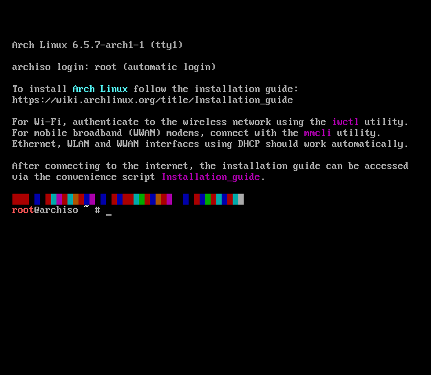

# Project 1 - "Arch Linux"

### System Administration Fall 2023

### Zack Mattie

## Arch Linux Installation

### Part 1
- To begin, the Arch Linux Wiki must be read! Of course, the first thing I do is skim through it and find out what's important or not.

- First step is to download the ISO file from the Arch Linux Downloads page. This can be found here: [Arch Linux Download](https://archlinux.org/download/)

- After downloading the ISO file, the only thing left to do is load it into VMWare Workstation!

- First click "Create New Virtual Machine" then load in the ISO file and continue.

- Next step I selected Linux and the OS specifications is just "Other Linux 5.x Kernel 64-bit" because Arch Linux was not listed as possible options.

- Next I changed the VM name to "ArchLinux" and changed the storage location on host to where I chose.

- Then I changed disk size from 8 GB to 20 GB. This is important as noted in class that 8 GB could be an issue.

- This is technically the last step, which allows you to customize your hardware. I increased my RAM to 2GB instead of the default 768 MB.

- Part 1 of setting up is now complete. The Arch Linux is ready to be ran in VMWare.

### Part 2
- After booting up the VM for the first time, you have a couple options. I chose the first option of default installing Arch Linux 64 bit.

- The VM takes its time (5 min) to set up and set up the OS by installing pacman, the package manager for Arch Linux as well as a few other configurations.

### Part 3
- The terminal is now showing, as shown above. There are several configurations necessary to be made in order to get this to be a well-oiled machine.

- The first thing is to shut down the VM and edit the .vmx file and insert the following line as line 2:  `firmware = "efi"`.

- After booting back up the VM, I immediately changed the font of the terminal so I won't go blind in 20 years. I did this with the command `setfont drdos8x16`.

- Once this has changed, I did a quick check to make sure UEFI has been set correctly. This is done by using the command `cat /sys/firmaware/efi/fw_platform_size`. This returns 64 for 64-bit or 32 for 32-bit UEFI mode. My command returned `64`, therefore, it booted in UEFI mode with a 64-bit x64 UEFI configuration.

- For the network configuration with Arch Linux, nothing is necessary to set up. My host is using an Ethernet connection and the VM automatically uses that connection for its own, therefore, nothing is needed for this step.

- For the system clock, the command `timedatectl` will show all current times with local, universal, RTC, and time zone being the most relevant. I noticed that local time's default is UTC, which meant that the time zone much be changed in order to change the local time. 

- I found the command to show all timezones with `timedatectl list-timezones`. I arrowed down until I found my relevant timezone: America/Chicago. Then I used the command `timedatectl set-timezone America/Chicago` and followed that up with `timedatectl` again to see if the output changed. The picture below shows the updated and correct time, date, and time zone. 

- At this point, I realized it is probably important to save a snapshot of my VM in case I decide to screw things up at any given time. 
I saved a snapshot, named it, and shut my VM down to make sure the snapshot worked as advertised.

- After shutting down and booting back up, I realized that the OS hasn't been set up to load onto the allocated disk. Instead, it was booting from memory. That means THANK GOD my snapshot saved and worked because otherwise all previous steps are lost.

- With the saved snapshot loaded successfully, I will continue on with partitioning and formatting disks in order to properly install Arch Linux.

### Part 4
- First step I took was using the command `fdisk -l` to show current disks. First one is `/dev/sda` which is the 20GB allocated disk, the other one showing is `dev/loop0` which is essentially the ISO file. 

- Since my allocated 20G disk is `/dev/sda`, I want to partition it. This can be done with `cfdisk /dev/sda`. I select the GPT label because this is the scheme used with UEFI specification. After reading more into the Partitioning section of the Arch Linux Wiki, the GPT scheme is preferred when wanting a UEFI boot. 

- A new screen pops up with all 20 gigabytes of space showing as "free space." I hit enter to start a new partition. The first partition I want to make is for the UEFI boot loader which will be called "EFI System." I chose to use 500M for the boot loader, which is more than plenty. After typing in `500M`, I had to arrow over to "Type" and scroll up to find "EFI System" which is the correct option for this partition.

- The next partition I create is completely optional. I read through the Arch Linux Wiki, and it says that a swap partition can help extend the virtual memory beyond the installed physical RAM. As this may become useful down the road, I went on ahead and allocated 4GB to this. I did this by selected the remaining free space (19.5G) and hitting enter on "new." Then I typed in `4G` and changed type to `Linux swap`. 

- The last and remaining free space available shows as 15.5G now on the partition table. This will be allocated towards the Linux filesystem. To do this, arrow down to the "free space" row, hit enter for "new", and hit enter again for 15.5G. The default type is "Linux filesystem" so changing the type is not necessary.

- IMPORTANT: It is extremely important to now arrow over to the "write" option in order to essentially save these changes. Hitting enter on the "write" option will prompt with a question to make sure these are the changes I want. I type `yes` and hit enter. The message `The partition table has been altered.` shows up. 

- Once this message shows up, the partitioning disk section is complete. I quit out of the partition table and use `fdisk -l` to see the changes I have made. 

### Part 5
- The first step for formatting my partitions is to format the Linux filesystem. To do this, I use the command `mkfs.ext4 /dev/sda3`. In this situation, my `sda3` is my Linux filesystem which is 15.5GB. 

- The next step is to format the swap partition using the command `mkswap /dev/sda2`. To enable the swap partition for use, I type the command `swapon -a`. 

- Lastly, I format the EFI System partition using `mkfs.fat -F 32 /dev/sda1`. This completes the formatting of partitions. Now I must mount them in order to properly use/access them.

- To mount the file systems, I use `cd /mnt` to navigate to the correct directory. I want to mount the Linux filesystem which is `sda3`, which means the command `mount /dev/sda3 /mnt` is used to mount it. 

- Since I have a UEFI system, I must also mount that EFI System partition which is `sda1`. This can be done with `mount --mkdir /dev/sda1 /mnt/boot`. Now I can use `ls` in the `/mnt` folder to see two mounts: `boot` and `lost+found` which is correct. 

- With this, I save another snapshot knowing that all partitions have been created and formatted to my liking.

### Part 6
- The next step is to install the essential packages to get carried over for formatting the OS/kernel correctly. This can be used with the `pacstrap` command. For this installation, I grab the essential packages and a few more like `nano`. The full command I used was `pacstrap /mnt base linux linux-firmware nano man dhcpcd networkmanager sudo`. 
    - IMPORTANT: Make sure to install nano, dhcpcd, and sudo as I could not continue without networking configurations or sudo permissions.

### Part 7
- The last thing to do is to configure the system we have now set up. 

- First thing to do is to generate an "fstab" file to define how disk partitions should be mounted into the file system. This can be done with `genfstab -U /mnt >> /mnt/etc/fstab`.

- Next, I change root into the new system that's created using the command `arch-chroot /mnt`.

- Now that I am acting like root, I can set the password for the root using `passwd`. I type `passwd` and then type in `root` to keep the password simple for this exercise. 

- Next step is to change the time zone and clock. This is done with `ln -sf /usr/share/zoneinfo/America/Chicago /etc/localtime`. The system clock can be generated with `hwclock --systohc`.

- The next step is to edit the `etc/locale.gen` to uncomment the US UTF-8 locale to help format regional text, time, date, and symbols. This can be done with using the nano text editor by typing `nano /etc/locale.gen` and arrowing down to find the necessary locale. I found `en_US.UTF-8 UTF-8` and uncommented it out. Then saved the file with the nano text editor and exited. 

- Next I create the locale.conf file and set the LANG variable to the correct uncommented locale. This can be done with `nano /etc/locale.conf` and then typing in `LANG=en_US.UTF-8` as the only line in the file. Then I saved and exited the nano text editor. 

- I also need to configure the network hostname. I do this with the command `nano /etc/hostname` and add 1 line to the file specifying my hostname. For this purpose, I put `ArchVM` and then save and exit. 

- The last step is to configure the bootloader. Since I have a UEFI system with an EFI System partition, I chose GRUB as my bootloader. I must install using `pacman -S grub` and `pacman -S efibootmgr`.

- Now I can use GRUB to install the bootloader correctly. The command is `grub-install --target=x86_64-efi --efi-directory=/boot --bootloader-id=GRUB`. where /boot is the mount point for the EFI System partition. The target is 64 bit based and the directory must be /boot because that is the mount point for sda1. 

- The main configuration file must be generated now for GRUB to detect. This can be done with `grub-mkconfig -o /boot/grub/grub.cfg`.

- The GRUB documentation doesn't specify if this is the last step. But I read the next few lines of text and it said it added a new entry for boot options. I deemed that a success and typed `exit` then `reboot`. After a few seconds, a new screen pops up with GRUB bootloader and one entry showing "Arch Linux". A picture of this is below.

- Once inside my ArchVM terminal, I type in `dhcpdcd` to get the host information from the DHCP server and configure the network interface. It also writes the DNS information to resolv.conf.

- This marks the conclusion of installing Arch Linux. I now have a working terminal after logging into root. I saved a snapshot just in case anything went wrong.

## Arch Linux Modifications

### Part 1
- To begin modifying my Arch Linux installation, I am going to create a user account for myself and for Codi, both having sudo permissions. First, I make sure all sudo packages are installed by running `pacman -Syu` and `pacman -S sudo`. 

- Now I will create a sudo user for myself with `useradd --create-home zackm` and then `passwd zackm` to set the password of my user. Same will be done for Codi with `useradd --create-home codi` and `passwd codi` setting the password to GraceHopper1906.

- The assignment instructions say that codi must be prompted to change password at login. To do this, I used `passwd --expire codi` then `chage -l codi` to verify that it says "password must be changed" in the respective rows.

- To make these two users havve sudo permissions, I must do the following few steps. First, I add them to the "wheel" group which is essentially the "sudo" group. I do this with `usermod -aG wheel zackm` and `usermod -aG wheel codi`. Now I must make sure that the group "wheel" has all permissions like sudo. To do that, I edit "/etc/sudoers" using nano. The command is `nano /etc/sudoers` and then arrow down until it says "## Uncomment to allow members of group wheen to execute any command." I uncomment the next line that says `%wheel ALL=(ALL:ALL) ALL` then exit and save.

- I can check that the users have the correct permissions by typing `sudo -lU zackm` or `sudo -lU codi` which should respond with "user may run the following commands on ArchVM: (ALL : ALL) ALL".

- I will save another snapshot since this part is over.

### Part 2
- I began with some research on desktop environments for Arch Linux. I landed on GNOME for a multitude of reasons. It looks nice and modern with useful features and popular applications.

- I run `pacman -S gnome gnome-extra` and then hit enter for all the default options to install all packages. Then I install "X" environment for a display server. I do this with `pacman -S xorg-server xorg-apps` and hit enter to install all packages.

- I have a NVIDIA graphics card therefore I must install a video driver. I run `pacman -S nvidia nvidia-utils`

- Then I must enable the display manager and network manager using `systemctl enable gdm` and `systemctl enable NetworkManager` respectively. 

- Once complete, I reboot and choose the install on the GRUB boot loader. It takes a second but the GNOME log in GUI loads in. A picture of this is below.

- For the purposes of continuing the exercise, I log back into root and can view the home screen. I open up terminal and save another snapshot.

### Part 3
- To install another shell, I first look at the shell I'm currently using with `echo $SHELL` which responds with "/bin/bash". I decide I want to use the zsh shell which requires me to use `pacman -S zsh zsh-completions` to install. 

- To prompt using zsh shell, I type in `zsh` and it pulls up automatically showing "ArchVM# " which is how the zsh shell should look. 

- To make zsh default, first I type `chsh -l` which listed all installed shells. Then I type `chsh -s /usr/bin/zsh` to change the default shell to zsh.

### Part 4
- To add a shell alias, there are several that I want. An important one is "c" for "clear". To create this I use `alias c="clear"`. Some more I use are `alias h="history"`, `alias j="jobs -l`, and `alias update="sudo pacman -Syu"`. 

- To add color to my zsh shell, I found a really cool one called "Oh My ZSH" which I installed using `sh -c "$(curl -fsSL https://raw.github.com/robbyrussell/oh-my-zsh/master/tools/install.sh)"`. The final product is shown below.

